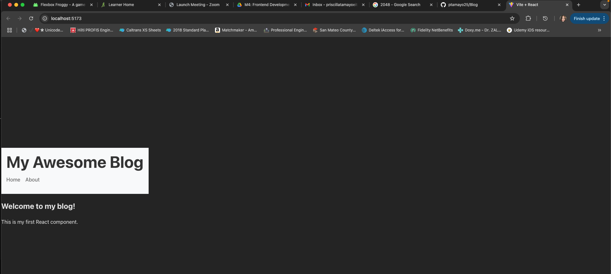
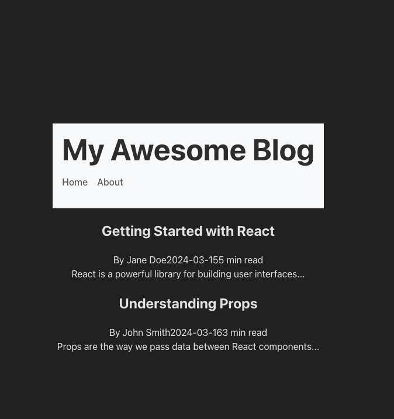
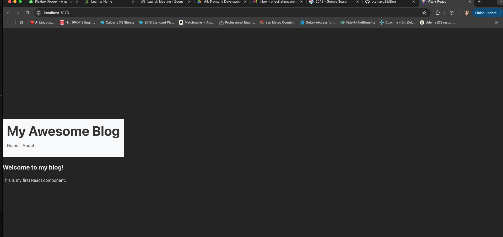

# My React Blog

A blog platform built with React and Vite.

## Setup Instructions

1. Clone the repository
2. Run `npm install`
3. Run `npm run dev`
4. Open http://localhost:5173 in your browser

## Project Structure

Blog/blog-react-app/ # Vite template with REACT
├──node_modules/ # Dependencies (don't modify)
├──public/ # Static files
├──src/ # Main source code
│ ├──components/ # components section for reusable components
│ │ └──Header.jsx # header component
│ ├── App.jsx # Main application component
│ ├── main.jsx # Application entry point
│ ├── index.css # Global styles
│ └── .gitignore # Ignore file for git repo
├── eslint.config.js # vite configuration template file
├── index.html # root creation file  
├── package-lock.json # Project configuration
├── package.json # Project configuration
└── vite.config.js # Vite configuration

## Screenshot



## What I Learned

1. Refreshed how to create a branch on github
2. Learned how to pull branch into repo
3. Learned typical project structure and where to file components

```

### GitHub Repository Structure
```

## Components Structure

- BlogPost: Individual blog post display
- BlogList: Container for multiple posts
- Header: Navigation and site title

## Styling Approach

CSS Modules (scoped CSS) because the assignment styling challenge was to use this for Blogpost css
regular CSS used elsewhere

## New Features

Added Blog Post and Blog list components

## Screenshots

Desktop Screenshot:


Mobile Screenshot:

